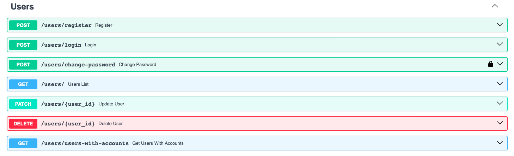
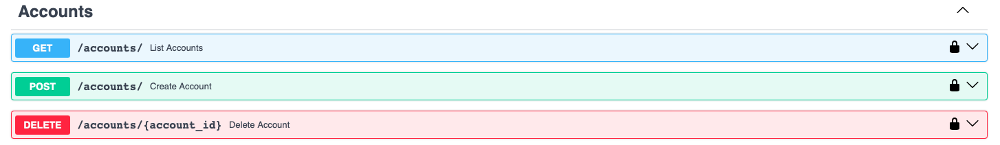
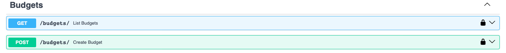
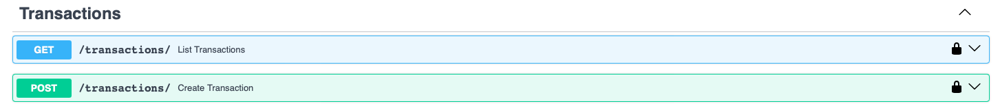
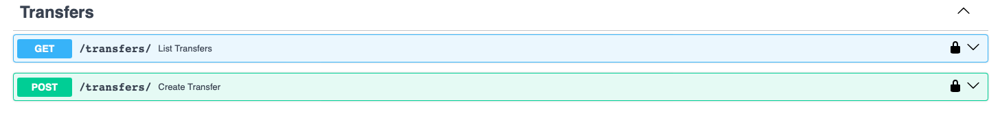

## users



- регистрация
```python
@router.post("/register", response_model=UserRead)
def register(user: UserCreate, session: Session = Depends(get_session)):
    db_user = session.exec(select(User).where(User.email == user.email)).first()
    if db_user:
        raise HTTPException(status_code=400, detail="Email already registered")

    hashed_password = get_password_hash(user.password)
    new_user = User(email=user.email, username=user.username, hashed_password=hashed_password)
    session.add(new_user)
    session.commit()
    session.refresh(new_user)
    return new_user
```
- вход
```python
@router.post("/login")
def login(user: UserCreate, session: Session = Depends(get_session)):
    db_user = session.exec(select(User).where(User.email == user.email)).first()

    if not db_user or not verify_password(user.password, db_user.hashed_password):
        raise HTTPException(status_code=400, detail="Incorrect email or password")

    access_token = create_jwt_token(data={"sub": str(db_user.id)}, expires_delta=timedelta(minutes=30))
    return {"access_token": access_token, "token_type": "bearer"}
```
- смена пароля
```python
@router.post("/change-password", dependencies=[Depends(bearer_scheme)])
def change_password(
    request: ChangePassword,
    session: Session = Depends(get_session),
    current_user: User = Depends(get_current_user)
):
    # проверка старого пароля
    if not verify_password(request.old_password, current_user.hashed_password):
        raise HTTPException(status_code=400, detail="Incorrect old password")

    # cмена на новый пароль
    current_user.hashed_password = get_password_hash(request.new_password)
    session.add(current_user)
    session.commit()

    return {"message": "Password changed successfully"}
```
- список пользователей
```python
@router.get("/")
def users_list(session=Depends(get_session)) -> List[User]:
    return session.exec(select(User)).all()
```
- редактирование информации пользователя
```python
@router.patch("/{user_id}", response_model=User)
def update_user(user_id: int, user: UserDefault, session: Session = Depends(get_session)):
    db_user = session.get(User, user_id)
    user_data = user.model_dump(exclude_unset=True)
    user_data.pop("hashed_password", None)
    for key, value in user_data.items():
        setattr(db_user, key, value)
    session.add(db_user)
    session.commit()
    session.refresh(db_user)
    return db_user
```
- удаление пользователя
```python
@router.delete("/{user_id}")
def delete_user(user_id: int, session: Session = Depends(get_session)):
    user = session.get(User, user_id)
    accounts = session.exec(select(Account).where(Account.user_id == user_id)).all()
    for account in accounts:
        transactions = session.exec(select(Transaction).where(Transaction.account_id == account.id)).all()
        for transaction in transactions:
            session.delete(transaction)
        transfers = session.exec(select(Transfer).where(Transfer.from_account_id == account.id)).all()
        for transfer in transfers:
            session.delete(transfer)

   
    for account in accounts:
        session.delete(account)
    budgets = session.exec(select(Budget).where(Budget.user_id == user_id)).all()
    for budget in budgets:
        session.delete(budget)
  
    session.delete(user)
    session.commit()
    return {"ok": True}
```
- список пользователей с их счетами (вложенный запрос)
```python
@router.get("/users-with-accounts")
def get_users_with_accounts(session: Session = Depends(get_session)):
    users = session.exec(select(User)).all()
    result = []

    for user in users:
        session.refresh(user, attribute_names=["accounts"])
        result.append({
            "id": user.id,
            "username": user.username,
            "email": user.email,
            "accounts": [
                {
                    "id": acc.id,
                    "name": acc.name,
                    "balance": acc.balance,
                    "is_goal": acc.is_goal,
                    "target_amount": acc.target_amount
                }
                for acc in user.accounts
            ]
        })

    return result
```

## accounts



- список счетов
- добавление нового счета
- удаление счета

## budgets



- список бюджетов
- установить бюджет на месяц

## transactions



- список транзакций
- транзакция

## transfers



- список переводов
```python
@router.get("/", response_model=List[Transfer])
def list_transfers(session: Session = Depends(get_session)):
    return session.exec(select(Transfer)).all()
```
- перевод
```python
@router.post("/", response_model=Transfer)
def create_transfer(transfer: TransferDefault, session: Session = Depends(get_session)):
    if transfer.from_account_id == transfer.to_account_id:
        raise HTTPException(status_code=400, detail="Cannot transfer to the same account")

    from_account = session.get(Account, transfer.from_account_id)
    to_account = session.get(Account, transfer.to_account_id)

    if not from_account or not to_account:
        raise HTTPException(status_code=404, detail="Account not found")

    if from_account.balance < transfer.amount:
        raise HTTPException(status_code=400, detail="Insufficient funds in source account")

    from_account.balance -= transfer.amount
    to_account.balance += transfer.amount

    transfer = Transfer.model_validate(transfer)
    session.add(transfer)
    session.add(from_account)
    session.add(to_account)
    session.commit()
    session.refresh(transfer)
    return transfer
```